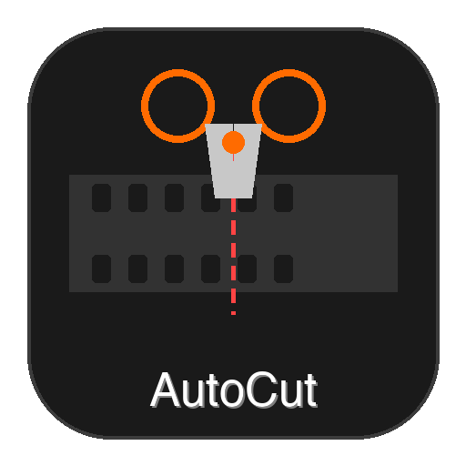

# AutoCut

<p align="center">
  
</p>

<p align="center">
  <strong>Automatic Silence Removal Tool for Video Editors</strong>
</p>

<p align="center">
  <a href="#features">Features</a> •
  <a href="#installation">Installation</a> •
  <a href="#usage">Usage</a> •
  <a href="#building">Building</a> •
  <a href="#türkçe">Türkçe</a>
</p>

---

## Features

### Silence Detection
- **Automatic Detection**: Intelligently detects silent regions in video/audio files using FFmpeg's silencedetect filter
- **Customizable Thresholds**: Adjust silence threshold (dB), minimum duration, and padding settings
- **Voice Activity Detection (VAD)**: Optional VAD for more accurate speech detection
- **Smart Merging**: Automatically merges nearby silence regions to avoid choppy edits

### Timeline & Preview
- **Waveform Visualization**: Real-time waveform display with zoom and pan controls
- **Visual Cut Markers**: See detected silences directly on the timeline
- **Video Preview**: Built-in video player with frame-accurate seeking
- **Skip Cuts Mode**: Preview your video as if silences were already removed

### Export Options
- **Final Cut Pro (FCPXML)**: Native timeline export for Final Cut Pro X
- **Adobe Premiere Pro (XML)**: Compatible XML format for Premiere Pro
- **DaVinci Resolve (EDL)**: Edit Decision List for DaVinci Resolve
- **Direct Render**: Export a new video file with silences removed (no NLE required!)

### AI Transcription
- **Whisper Integration**: Local AI transcription using faster-whisper
- **Gemini AI Support**: Cloud-based transcription via Google Gemini API
- **Multiple Models**: Choose from tiny to large models based on speed/accuracy needs
- **Export Transcript**: Save transcripts as TXT files

### User Experience
- **Multi-language UI**: Full support for English and Turkish
- **Preset Configurations**: Quick presets for Podcast, Tutorial, Meeting, Noisy Room, and Aggressive editing
- **Dark Theme**: Modern dark interface designed for video editors
- **Auto-save**: Never lose your work with automatic project saving
- **Guided Tour**: First-launch tutorial to get you started quickly

## Requirements

- **Python**: 3.10 or higher
- **FFmpeg**: Required for audio/video processing
- **Operating System**: macOS, Windows, or Linux

### FFmpeg Installation

**macOS** (automatic installation available in-app via Homebrew):
```bash
brew install ffmpeg
```

**Windows**:
```bash
winget install ffmpeg
# or download from https://ffmpeg.org/download.html
```

**Linux (Ubuntu/Debian)**:
```bash
sudo apt install ffmpeg
```

## Installation

### From Source

```bash
# Clone the repository
git clone https://github.com/unkownpr/auto_edit_video.git
cd auto_edit_video

# Create virtual environment
python -m venv .venv
source .venv/bin/activate  # On Windows: .venv\Scripts\activate

# Install dependencies
pip install -r requirements.txt

# Run the application
python main.py
```

### Dependencies

Core dependencies:
- `PySide6` - Qt6 GUI framework
- `numpy` - Numerical computing
- `scipy` - Signal processing
- `lxml` - XML processing for FCPXML export

Optional (for transcription):
- `faster-whisper` - Local AI transcription
- `google-generativeai` - Gemini API integration

## Usage

### Basic Workflow

1. **Import Video**: Click "Import Video" or drag & drop a video file
2. **Select Preset**: Choose a preset that matches your content type
3. **Analyze**: Click "Analyze Audio" to detect silent regions
4. **Review**: Check detected cuts in the timeline and adjust if needed
5. **Export**: Choose your export format or render a new video directly

### Detection Settings

| Setting | Description | Recommended Range |
|---------|-------------|-------------------|
| **Threshold** | Volume level below which audio is considered silence | -40 to -25 dB |
| **Min Duration** | Minimum silence length to detect | 300-800 ms |
| **Pre Padding** | Time to keep before detected silence | 50-150 ms |
| **Post Padding** | Time to keep after detected silence | 100-200 ms |
| **Merge Gap** | Merge silences closer than this | 200-400 ms |
| **Keep Short Pauses** | Preserve natural speech pauses shorter than this | 100-200 ms |

### Presets

- **Podcast**: Conservative settings, preserves natural pauses
- **Tutorial**: Balanced for instructional content
- **Meeting**: Light editing for meeting recordings
- **Noisy Room**: Higher threshold for background noise
- **Aggressive**: Maximum silence removal

### Keyboard Shortcuts

| Shortcut | Action |
|----------|--------|
| `Ctrl+O` | Open file |
| `Ctrl+S` | Save project |
| `Ctrl+E` | Export timeline |
| `Ctrl+=` | Zoom in timeline |
| `Ctrl+-` | Zoom out timeline |
| `Ctrl+0` | Fit timeline to view |
| `Space` | Play/Pause |

## Building

### macOS (.app bundle)

```bash
# Install PyInstaller
pip install pyinstaller

# Build the application
python build.py

# Output: dist/AutoCut.app
```

### Creating DMG (macOS)

```bash
# Install dmgbuild
pip install dmgbuild

# Build .app first
python build.py

# Create DMG
dmgbuild -s dmg_settings.py "AutoCut" AutoCut.dmg
```

### Windows (.exe)

```bash
# Build the application
python build.py

# Output: dist/AutoCut/AutoCut.exe
```

## Project Structure

```
auto_video_edit/
├── app/
│   ├── core/           # Core models, settings, i18n
│   ├── media/          # FFmpeg wrapper, waveform generation
│   ├── analysis/       # Silence detection algorithms
│   ├── export/         # FCPXML, EDL, Premiere XML exporters
│   ├── transcript/     # Whisper & Gemini transcription
│   └── ui/             # Qt widgets and dialogs
├── resources/          # Icons and assets
├── tests/              # Unit tests
├── build.py            # Build script
├── main.py             # Application entry point
└── requirements.txt    # Python dependencies
```

## License

MIT License - See [LICENSE](LICENSE) for details.

## Author

Developed by [ssilistre.dev](https://ssilistre.dev)

---

# Türkçe

## AutoCut - Otomatik Sessizlik Kaldırma Aracı

AutoCut, video düzenleyiciler için tasarlanmış otomatik sessizlik kaldırma aracıdır. Videolarınızdaki sessiz bölgeleri otomatik olarak tespit eder ve NLE programlarına (Final Cut Pro, Premiere Pro, DaVinci Resolve) aktarmanızı veya doğrudan yeni bir video oluşturmanızı sağlar.

## Özellikler

### Sessizlik Tespiti
- **Otomatik Tespit**: FFmpeg'in silencedetect filtresi ile sessiz bölgeleri akıllıca tespit eder
- **Özelleştirilebilir Eşikler**: Sessizlik eşiği (dB), minimum süre ve dolgu ayarlarını yapılandırın
- **Ses Aktivite Tespiti (VAD)**: Daha doğru konuşma tespiti için isteğe bağlı VAD
- **Akıllı Birleştirme**: Kesik düzenlemeleri önlemek için yakın sessizlik bölgelerini otomatik birleştirir

### Zaman Çizelgesi ve Önizleme
- **Dalga Formu Görselleştirme**: Yakınlaştırma ve kaydırma kontrolleriyle gerçek zamanlı dalga formu
- **Görsel Kesim İşaretçileri**: Tespit edilen sessizlikleri doğrudan zaman çizelgesinde görün
- **Video Önizleme**: Kare hassasiyetinde arama yapabilen dahili video oynatıcı
- **Kesimleri Atla Modu**: Videonuzu sessizlikler zaten kaldırılmış gibi önizleyin

### Dışa Aktarma Seçenekleri
- **Final Cut Pro (FCPXML)**: Final Cut Pro X için yerel zaman çizelgesi dışa aktarımı
- **Adobe Premiere Pro (XML)**: Premiere Pro için uyumlu XML formatı
- **DaVinci Resolve (EDL)**: DaVinci Resolve için Edit Decision List
- **Doğrudan Render**: Sessizlikleri kaldırılmış yeni video dosyası oluşturun (NLE gerekmez!)

### AI Transkripsiyon
- **Whisper Entegrasyonu**: faster-whisper ile yerel AI transkripsiyonu
- **Gemini AI Desteği**: Google Gemini API ile bulut tabanlı transkripsiyon
- **Çoklu Modeller**: Hız/doğruluk ihtiyacına göre küçükten büyüğe model seçimi
- **Transkript Dışa Aktarma**: Transkriptleri TXT dosyası olarak kaydedin

### Kullanıcı Deneyimi
- **Çok Dilli Arayüz**: İngilizce ve Türkçe tam destek
- **Hazır Ayarlar**: Podcast, Eğitim, Toplantı, Gürültülü Ortam ve Agresif düzenleme için hızlı ayarlar
- **Koyu Tema**: Video düzenleyiciler için tasarlanmış modern koyu arayüz
- **Otomatik Kaydetme**: Otomatik proje kaydetme ile çalışmanızı asla kaybetmeyin
- **Rehberli Tur**: Hızlıca başlamanız için ilk açılış eğitimi

## Gereksinimler

- **Python**: 3.10 veya üstü
- **FFmpeg**: Ses/video işleme için gerekli
- **İşletim Sistemi**: macOS, Windows veya Linux

### FFmpeg Kurulumu

**macOS** (uygulama içinden Homebrew ile otomatik kurulum mevcut):
```bash
brew install ffmpeg
```

**Windows**:
```bash
winget install ffmpeg
# veya https://ffmpeg.org/download.html adresinden indirin
```

**Linux (Ubuntu/Debian)**:
```bash
sudo apt install ffmpeg
```

## Kurulum

```bash
# Depoyu klonlayın
git clone https://github.com/unkownpr/auto_edit_video.git
cd auto_edit_video

# Sanal ortam oluşturun
python -m venv .venv
source .venv/bin/activate  # Windows: .venv\Scripts\activate

# Bağımlılıkları yükleyin
pip install -r requirements.txt

# Uygulamayı çalıştırın
python main.py
```

## Kullanım

### Temel İş Akışı

1. **Video İçe Aktar**: "Video İçe Aktar" butonuna tıklayın veya sürükle bırak yapın
2. **Hazır Ayar Seçin**: İçerik türünüze uygun bir hazır ayar seçin
3. **Analiz Et**: Sessiz bölgeleri tespit etmek için "Sesi Analiz Et" butonuna tıklayın
4. **İncele**: Zaman çizelgesindeki kesimleri kontrol edin ve gerekirse ayarlayın
5. **Dışa Aktar**: Dışa aktarma formatınızı seçin veya doğrudan yeni video oluşturun

### Tespit Ayarları

| Ayar | Açıklama | Önerilen Aralık |
|------|----------|-----------------|
| **Eşik Değeri** | Sesin sessizlik olarak kabul edildiği ses seviyesi | -40 ile -25 dB |
| **Min Süre** | Tespit edilecek minimum sessizlik uzunluğu | 300-800 ms |
| **Ön Boşluk** | Tespit edilen sessizlikten önce tutulacak süre | 50-150 ms |
| **Son Boşluk** | Tespit edilen sessizlikten sonra tutulacak süre | 100-200 ms |
| **Birleştirme Aralığı** | Bu değerden daha yakın sessizlikleri birleştir | 200-400 ms |
| **Kısa Duraklamaları Koru** | Bu değerden kısa doğal konuşma duraklamalarını koru | 100-200 ms |

### Hazır Ayarlar

- **Podcast**: Muhafazakar ayarlar, doğal duraklamaları korur
- **Eğitim Videosu**: Eğitim içerikleri için dengeli
- **Toplantı**: Toplantı kayıtları için hafif düzenleme
- **Gürültülü Ortam**: Arka plan gürültüsü için yüksek eşik
- **Agresif**: Maksimum sessizlik kaldırma

### Klavye Kısayolları

| Kısayol | İşlem |
|---------|-------|
| `Ctrl+O` | Dosya aç |
| `Ctrl+S` | Projeyi kaydet |
| `Ctrl+E` | Zaman çizelgesini dışa aktar |
| `Ctrl+=` | Zaman çizelgesini yakınlaştır |
| `Ctrl+-` | Zaman çizelgesini uzaklaştır |
| `Ctrl+0` | Zaman çizelgesini sığdır |
| `Space` | Oynat/Duraklat |

## Derleme

### macOS (.app paketi)

```bash
# PyInstaller yükleyin
pip install pyinstaller

# Uygulamayı derleyin
python build.py

# Çıktı: dist/AutoCut.app
```

### DMG Oluşturma (macOS)

```bash
# dmgbuild yükleyin
pip install dmgbuild

# Önce .app derleyin
python build.py

# DMG oluşturun
dmgbuild -s dmg_settings.py "AutoCut" AutoCut.dmg
```

## Lisans

MIT Lisansı

## Geliştirici

[ssilistre.dev](https://ssilistre.dev) tarafından geliştirilmiştir.
